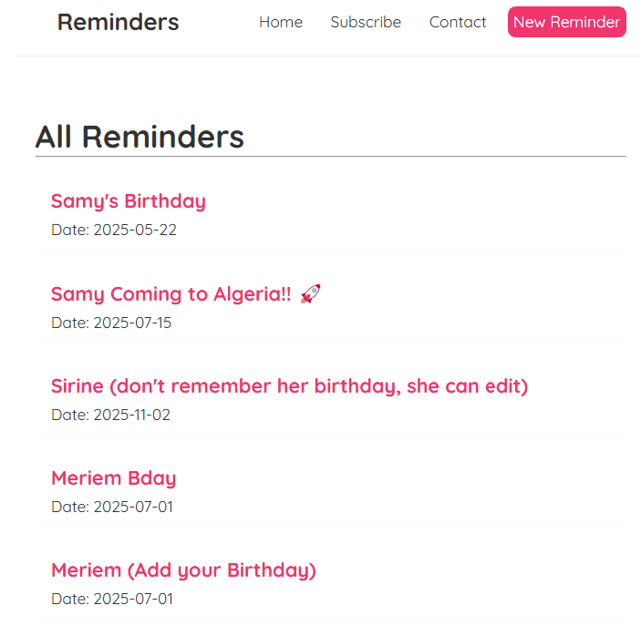

# Reminder App

This is a React-based app for managing reminders, with a backend API deployed on Render and a frontend hosted on Netlify.

- **Functioning Frontend Link**: [https://family-reminders.netlify.app/](https://family-reminders.netlify.app/)
- **Backend Link**: [Link for Postman](https://reminders-backend2.onrender.com)

Manage API and frontend

- **Frontend Link**: [Netlify](https://app.netlify.com/sites/family-reminders/overview)
- **Backend Link**: [Render](https://dashboard.render.com/web/srv-cu7d673qf0us73e4a8j0/deploys/dep-cu7d67bqf0us73e4a8mg)
- **Database Link**: [MongoDB](https://cloud.mongodb.com/v2/678d422bb5966b0ad6196960#/metrics/replicaSet/678d431cdea7ee35c34262e1/explorer/reminders/reminders/find)
- **Schedule Reminders Link**: [Cron Jon](https://console.cron-job.org/dashboard)
- **Keep Server Alive Link**: [UptimeRobot](https://dashboard.uptimerobot.com/monitors#mainDashboard)

---

## 

## TL;DR: Quick Start Commands

1. **Install Dependencies**:
   Run this in both `frontend/` and `backend/` folders:

   ```bash
   npm install
   ```

2. **Start the Backend**:
   In the `backend/` folder, run:

   ```bash
   node server.js
   ```

3. **Start the Frontend**:
   In the `frontend/` folder, run:

   ```bash
   npm start
   ```

4. **Access the App**:
   - Frontend: `http://localhost:3000/`
   - Mock Database: `http://localhost:8000/reminders`
   - Backend API: `http://localhost:5000/api/reminders`
   - Test Sending Emails to Subscribers Locally: `http://localhost:5000/test-daily-task`
   - Test Sending Emails to Subscribers Online: `https://reminders-backend2.onrender.com/test-daily-task`

---

## How to Run This Project Locally

### Prerequisites

1. Install [Node.js](https://nodejs.org/) (includes `npm`).
2. Clone the repository to your local machine.

---

### Step 1: Install Dependencies

Navigate to the project directory and install the dependencies for both the frontend and backend:

**Frontend**:

```bash
cd frontend
npm install
```

**Backend**:

```bash
cd ../backend
npm install
```

---

### Step 2: Start the Backend

1. Start the mock database with `json-server`:

   ```bash
   npx json-server --watch data/db.json --port 8000
   ```

   This serves the database at `http://localhost:8000/reminders`.

2. Start the Node.js server:
   ```bash
   node server.js
   ```
   This serves the API at `http://localhost:5000/api`.

---

### Step 3: Start the Frontend

1. Navigate to the `frontend` directory:
   ```bash
   cd ../frontend
   ```
2. Start the React development server:
   ```bash
   npm start
   ```
   This serves the app at `http://localhost:3000`.

---

### Additional Step

Configure Email Credentials
Create a .env file in the backend folder.
Add the following environment variables for email functionality:

```bash
EMAIL_USER=your-email@example.com
EMAIL_PASS=your-email-password
```

These are required for sending emails via the backend.

### API Endpoints

- **Reminders Endpoint**:
  - `GET` all reminders: `http://localhost:5000/api/reminders`
  - `POST` a new reminder: `http://localhost:5000/api/reminders`
  - `PUT` update a reminder: `http://localhost:5000/api/reminders/:id`
  - `DELETE` a reminder: `http://localhost:5000/api/reminders/:id`

---

### Project Structure

- **Frontend**:
  - Built with React.
  - API calls are centralized in `frontend/src/config.js`.
- **Backend**:
  - Mock database: `backend/data/db.json`.
  - API routes: `http://localhost:5000/api`.

---

### Local Links

- Frontend: `http://localhost:3000/`
- Mock Database: `http://localhost:8000/reminders`
- Backend API: `http://localhost:5000/api/reminders`

---

### Notes

- Replace `http://localhost` with your machine’s IP address if testing on another device.
- Make sure the backend is running before starting the frontend for the app to fetch data properly.
